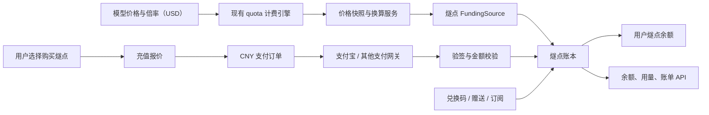

# 燧点计费与独立账本方案

## 文档信息

- 最后整理：2026-07-23（补充：第 18 节记录业务方已确认的决策）
- 适用范围：`modelrec-new-api` 的充值、余额、模型用量计费、退款、兑换码、订阅与账单展示
- 文档定位：现状分析与目标架构方案；不是已经完成的实现说明
- 本地代码基线：`df3ae79a55549f3d3524f5b68b56fb3047b964cc`
- 上游核对基线：`QuantumNous/new-api` `1721144221ec5c94dd87891a7ae1bee228e7bb63`（2026-07-21）

## 1. 问题背景

New API 的模型价格、模型倍率和 `QuotaPerUnit` 以 USD 等价价值为基础。人民币充值时，系统需要将购买的 USD 等价额度乘以 USD/CNY 计价倍率。例如业务计价为 `$1 = ¥7` 时，充值输入 `1` 会得到待支付 `¥7`。

这个计算在成本和利润层面有意义，但用户看到“充值 1、支付 7”时无法判断 `1` 是美元、人民币、额度还是积分，容易产生歧义。

本项目希望引入用户侧统一资产单位“燧点”，目标包括：

- 用户充值、余额、用量、账单和额度限制统一以燧点表达；
- 人民币与燧点的兑换规则可配置；
- 模型成本、模型价格和现有倍率继续以 USD 为基础，不删除原有 USD/CNY 计价关系；
- 支持 `¥1` 精确购买对应燧点，不要求用户按 `$1` 的整数倍充值；
- 支付、消费、失败退款、人工调整和历史审计保持金额一致且可追溯。

## 2. 核心结论

当前系统只部分支持“将自定义货币作为额度展示单位”，不支持“将燧点作为独立、精确、可审计的用户资产单位”。

单纯调整 `CustomCurrencyExchangeRate` 或修改前端文案不能完成目标。要精确支持 `¥1` 充值并让全链路使用燧点，需要增加独立的燧点钱包、不可变账本、版本化价格配置和统一结算适配层。

推荐保留现有 USD 模型计费核心，并建立四个明确分层：

```text
模型成本层：USD
内部计量层：raw quota
用户资产层：燧点/微燧点
支付结算层：CNY/分
```

## 3. 业务术语与不变量

### 3.1 术语

| 术语 | 含义 | 示例 |
| --- | --- | --- |
| 模型成本 USD | 上游模型或本地定价产生的 USD 成本 | `$0.01` |
| raw quota | 现有计费引擎的整数计量单位 | `5000 quota` |
| 燧点 | 用户看到并持有的服务积分 | `700 燧点` |
| 微燧点 | 燧点的内部最小记账单位 | `1 燧点 = 1,000,000 微燧点` |
| 支付金额 | 支付平台实际收取的法币金额 | `100 分 CNY` |
| 业务计价汇率 | USD 成本换算人民币售价时使用的配置汇率 | `7 CNY/USD` |
| 兑换配置版本 | 一次充值或用量结算所冻结的价格配置 | `2026-07-v1` |

### 3.2 建议的不变量

1. 支付金额一律使用整数最小法币单位保存，例如人民币“分”。
2. 燧点余额一律使用整数微燧点保存，不使用 `float64`。
3. 充值订单创建后，支付金额、到账燧点和兑换版本不可被当前配置覆盖。
4. 每次模型请求在预扣时冻结价格版本，最终结算和失败退款沿用同一版本。
5. 历史流水只追加冲正记录，不原地修改金额。
6. 同一个支付事件、模型请求或退款请求最多产生一次资产变更。

## 4. 当前系统实际能力

### 4.1 已实现能力

- `QuotaDisplayType` 支持 USD、CNY、TOKENS 和 CUSTOM。
- CUSTOM 支持自定义符号和 `1 USD = X Custom` 的展示汇率，见 [`general_setting.go`](../setting/operation_setting/general_setting.go)。
- 通用前端格式化、部分管理员额度输入和日志可以把 raw quota 换算为自定义货币。
- 模型价格、倍率、分组倍率和 `QuotaPerUnit` 可以计算出 raw quota。
- [`BillingSession`](../service/billing_session.go) 已集中处理预扣、补扣、返还和订阅/钱包选择。
- [`FundingSource`](../service/funding_source.go) 已抽象钱包与订阅资金来源，为增加燧点资金来源提供了接入点。

### 4.2 部分实现或不支持的能力

| 环节 | 当前状态 | 与目标的差距 |
| --- | --- | --- |
| CUSTOM 展示 | 部分支持 | 只是 `USD → 自定义单位` 的展示换算 |
| 充值输入 | 不支持燧点语义 | `amount` 仍是整数基础额度单位 |
| 人民币最小充值 | 不精确 | `QuotaPerUnit ÷ USD/CNY` 可能不是整数 |
| 充值订单 | 语义混乱 | `Amount`、`Money` 在不同支付渠道代表不同单位 |
| 用量扣费 | 使用 quota | 没有独立燧点余额和燧点流水 |
| 失败退款 | 以 quota 返还 | 普通钱包返还缺少统一业务幂等键 |
| 账单兼容 API | CUSTOM 不完整 | 部分接口只处理 CNY/TOKENS，CUSTOM 落入 USD 默认逻辑 |
| 历史审计 | 不完整 | 没有保存支付币种、到账额度和价格配置快照 |

### 4.3 当前自定义货币的准确含义

当前配置：

```text
CustomCurrencyExchangeRate = 10000
```

源码语义是：

```text
1 USD 等价基础单位 = 10000 自定义货币
```

它本身不表示 `¥1 = 10000 燧点`。如果 `$1 = ¥7` 且业务定义 `¥1 = 10000 燧点`，则展示层应推导出：

```text
1 USD = 7 × 10000 = 70000 燧点
```

但即使配置为 `70000`，当前充值接口仍以整数 USD 等价单位为主要输入，最多能自然表达“支付 ¥7，购买 70000 燧点”，不能精确表达“支付 ¥1，购买 10000 燧点”。

## 5. 为什么仅使用 quota 无法精确支持 ¥1

假设：

```text
QuotaPerUnit = 500000
业务计价汇率 = 7 CNY/USD
兑换规则 = 10000 燧点/CNY
```

则 `¥1` 对应的 raw quota 为：

```text
500000 ÷ 7 = 71428.571428... quota
```

现有 quota 主要使用整数存储和结算。如果继续把 quota 当作唯一用户余额，只能向上或向下取整，无法同时满足：

- 支付 `¥1.00`；
- 精确到账 `10000 燧点`；
- 余额反向换算仍然精确；
- 高频小额消费长期不产生累计误差。

因此，充值不能再通过“人民币 → USD 单位 → quota → 燧点”的路径入账，而应直接通过“人民币 → 燧点”入账。quota 继续用于模型成本计量和兼容，而不是用户资产的唯一真相来源。

## 6. 成熟产品的设计参考

### 6.1 OpenRouter：USD 基础 Credits

OpenRouter 将 Credits 明确建立在 USD 基础上，模型价格和余额都以美元表达。优点是成本、售价和余额单位一致，不存在第二套积分换算；缺点是不适合完全隐藏 USD 的产品体验。

- [OpenRouter Credit and Billing Systems](https://openrouter.ai/docs/faq)
- [OpenRouter Usage Accounting](https://openrouter.ai/docs/cookbook/administration/usage-accounting)

### 6.2 GitHub AI Credits：固定价值积分

GitHub 将模型 Token 成本转换为 AI Credits，并定义 `1 AI credit = $0.01 USD`。用户侧使用 Credits，底层仍按模型和 Token 计算成本。这是与燧点目标最接近的模式。

- [GitHub Models and pricing for Copilot](https://docs.github.com/en/copilot/reference/copilot-billing/models-and-pricing)

### 6.3 ElevenLabs / Adobe：抽象使用积分

ElevenLabs 和 Adobe 使用统一 Credits，由不同模型、功能、字符数或生成任务按不同规则消费，套餐负责分配积分。这类积分更接近服务使用权，不保证与法币永久一一对应。

- [ElevenLabs What are credits](https://help.elevenlabs.io/hc/en-us/articles/27562020846481-What-are-credits)
- [Adobe Generative credits FAQ](https://helpx.adobe.com/creative-cloud/apps/generative-ai/generative-credits-faq.html)

### 6.4 适用于本项目的归纳

本项目更适合采用“固定价值积分 + 独立成本核算”的混合模式：

- 模型成本仍按 USD 计算；
- 支付仍按 CNY 结算；
- 用户充值和消费统一使用燧点；
- 燧点基础面值、USD/CNY 业务计价汇率和充值赠送倍率分别配置；
- 每笔业务保存所使用的配置版本。

## 7. 目标架构



### 7.1 职责边界

- 模型定价层：计算本次请求的 USD 等价成本和 raw quota。
- 价格换算层：使用冻结的配置版本，将 USD/quota 换算为微燧点。
- 燧点资金来源：负责预扣、结算和失败退款。
- 燧点账本：记录所有资产增减，是审计真相来源。
- 用户余额：作为高频查询缓存，在同一事务中随账本更新。
- 支付服务：只负责收取 CNY、验证支付状态并返回可信支付事件，不直接修改 quota 或燧点。

## 8. 动态兑换配置设计

### 8.1 不应混为一个倍率的配置

建议至少拆分三个业务参数：

| 参数 | 作用 | 建议变更频率 |
| --- | --- | --- |
| `base_points_per_cny` | 燧点基础面值，例如 `10000` | 低频，谨慎修改 |
| `pricing_usd_cny_rate` | 模型 USD 价格换算人民币售价 | 可动态调整 |
| `topup_bonus_ratio` | 充值活动赠送倍率，例如 `1.2` | 可按活动调整 |

示例：

```text
base_points_per_cny = 10000
pricing_usd_cny_rate = 7.00
topup_bonus_ratio = 1.20
```

则：

```text
模型 $1 的基础售价 = 7 × 10000 = 70000 燧点
用户支付 ¥1 的基础到账 = 10000 燧点
活动期间用户支付 ¥1 的最终到账 = 12000 燧点
```

充值赠送不改变燧点基础面值，能避免使用一个兑换率同时承担面值、汇率和营销折扣三个职责。

### 8.2 配置版本模型

建议新增版本化配置实体：

```text
pricing_policy
  id
  version
  base_points_per_cny
  pricing_usd_cny_rate
  topup_bonus_ratio
  effective_at
  expired_at
  status
  created_by
  change_reason
  created_at
```

要求：

1. 已生效版本不原地覆盖，修改时创建新版本。
2. 同一时间最多一个有效默认版本。
3. 允许设置未来生效时间，避免正在支付或正在执行的请求突然换价。
4. 禁止使用二进制浮点保存倍率；使用定点整数或高精度 decimal 字符串。

### 8.3 修改兑换率对存量燧点的影响

如果将 `base_points_per_cny` 从 `10000` 修改为 `20000`，而模型消费也立即使用新值，那么用户原有 `10000` 燧点的购买力会从约 `¥1` 变成约 `¥0.5`。

因此需要明确两种业务动作：

- 调整基础面值：属于存量资产重新定价，应低频执行，并要求风险确认、公告和生效时间。
- 调整充值优惠：使用 `topup_bonus_ratio`，不改变历史燧点购买力，适合日常运营。

推荐基础面值在正式上线后保持稳定；动态能力主要用于 USD/CNY 业务计价汇率和充值赠送比例。

## 9. 数据模型方案

### 9.1 燧点钱包

```text
credit_wallet
  user_id                PK
  balance_micro_points   BIGINT
  version                BIGINT
  updated_at
```

`version` 用于乐观锁或缓存版本控制。余额必须与账本写入处于同一数据库事务。

### 9.2 燧点账本

```text
credit_ledger
  id
  user_id
  delta_micro_points
  balance_after_micro_points
  business_type
  reference_id
  idempotency_key        UNIQUE
  pricing_version
  source_bucket
  metadata
  created_at
```

建议的 `business_type`：

```text
topup
usage_reserve
usage_settle
usage_refund
redemption
subscription_grant
gift
admin_adjustment
payment_refund
chargeback
```

`source_bucket` 可区分：

```text
paid          付费燧点
promotional   赠送燧点
subscription  套餐燧点
```

为未来支持不同有效期、退款规则和扣减优先级预留边界。按已确认决策（第 18.1 节），首期扣减优先级保留现有系统行为，`source_bucket` 仅作为流水记录字段，不实现按桶优先级扣减。

### 9.3 充值订单快照

现有 [`TopUp`](../model/topup.go) 的 `Amount` 和 `Money` 无法清晰表达不同支付渠道的单位。目标订单至少需要：

```text
requested_micro_points
base_micro_points
bonus_micro_points
payment_amount_minor
payment_currency
pricing_version
points_per_cny_snapshot
bonus_ratio_snapshot
provider
provider_order_id
provider_event_id
quote_expires_at
```

支付回调只能使用订单快照入账，禁止重新读取当前兑换配置计算到账数量。

### 9.4 用量计费快照

每条最终用量记录建议保存：

```text
raw_quota
billable_cost_usd
pricing_usd_cny_rate_snapshot
points_per_cny_snapshot
charged_micro_points
pricing_version
request_id
```

利润核算：

```text
用户收入 CNY = charged_micro_points ÷ micro_scale ÷ points_per_cny_snapshot
上游成本 CNY = upstream_cost_usd × accounting_usd_cny_rate
毛利 CNY = 用户收入 CNY - 上游成本 CNY
```

财务成本汇率可与销售计价汇率分开保存，避免把利润倍率伪装成汇率。

## 10. 核心业务流程

### 10.1 ¥1 精确充值

配置：

```text
base_points_per_cny = 10000
topup_bonus_ratio = 1
```

报价：

```text
用户购买：10000 燧点
支付金额：100 分 CNY
```

计算全部使用整数：

```text
100 分 × 100 燧点/分 = 10000 燧点
```

支付成功后的单事务：

1. 根据平台事件 ID 检查幂等性。
2. 锁定本地充值订单。
3. 验证订单仍为待支付状态。
4. 验证回调币种为 CNY、金额为 100 分。
5. 写入 `topup` 燧点流水。
6. 增加钱包微燧点余额。
7. 标记充值订单成功并记录平台事件。
8. 提交事务后向支付平台返回成功。

该流程不执行 `500000 ÷ 7`，因此能够精确支持 `¥1 = 10000 燧点`。

### 10.2 模型用量扣费

假设：

```text
本次模型计费 = $0.01
pricing_usd_cny_rate = 7
base_points_per_cny = 10000
```

则：

```text
扣除燧点 = 0.01 × 7 × 10000 = 700 燧点
```

实现流程：

1. 现有计费引擎得到预估 raw quota 和 USD 等价成本。
2. 冻结 `pricing_policy` 版本。
3. 使用统一转换器计算预扣微燧点。
4. `SuidianFunding` 写入幂等预扣流水并扣减余额。
5. 请求完成后按实际总成本重新计算最终微燧点。
6. 最终值高于预扣则补扣，低于预扣则返还差额。
7. 用量记录保存 USD 成本、raw quota、燧点金额和价格快照。

建议直接以“最终总值减已预扣值”结算，不对多个中间差额分别取整，减少累计误差。

### 10.3 请求失败退款

退款必须以原预扣记录为依据：

```text
refund_idempotency_key = request_id + original_reservation_id
```

事务中写入一条相反金额的 `usage_refund` 流水并恢复余额。重复退款请求返回已有结果，不再次增加余额。

### 10.4 动态配置切换

- 充值订单使用创建报价时的配置版本。
- 模型请求使用预扣开始时的配置版本。
- 管理员修改配置只影响新报价和新请求。
- 旧订单、旧用量和旧流水不重新换算。

## 11. 与现有 New API 的集成方案

### 11.1 保留的部分

- 模型价格配置和模型倍率。
- `QuotaPerUnit` 与 raw quota 计算。
- Token、缓存、图像、音频和按次模型的现有计价逻辑。
- `BillingSession` 的预扣、结算和退款生命周期。
- 订阅优先、钱包优先等资金来源选择框架。

### 11.2 需要扩展的部分

新增：

```text
SuidianFunding
PricingSnapshot
CreditLedgerService
TopupQuoteService
```

现有 `FundingSource` 方法接收的是 quota 差额：

```text
PreConsume(amount int)
Settle(delta int)
Refund()
```

燧点方案需要保证预扣和最终结算使用同一个价格版本，并按最终总金额统一取整。因此不能只在每次 `delta` 上临时读取当前汇率。建议由 `BillingSession` 或新的结算上下文持有：

```text
request_id
pricing_snapshot
preconsumed_quota
preconsumed_micro_points
```

`SuidianFunding` 在结算时根据“最终总 quota/成本”计算最终微燧点，再减去已预扣微燧点得到补扣或返还值。

### 11.3 支付服务边界

如果支付宝等实际收款由独立的 Rust `pay-service` 完成：

- 支付服务负责创建法币订单、调用支付平台、验签和返回可信支付事件；
- New API 负责燧点报价、用户资产账本和入账；
- 支付事件必须携带本地订单号、平台订单号、支付金额最小单位、币种、事件 ID 和状态；
- 支付服务不得直接修改用户 quota 或燧点余额。

## 12. 精度与取整策略

### 12.1 存储精度

推荐：

```text
1 燧点 = 1,000,000 微燧点
1 CNY = 100 分
```

充值 `¥1`：

```text
10000 × 1,000,000 = 10,000,000,000 微燧点
```

### 12.2 计算规则

- 业务计算使用定点整数或 decimal，不使用 `float64`。
- 中间步骤不取整，只在最终微燧点边界取整一次。
- 正常扣费建议使用明确的四舍五入规则，例如 half-up。
- 余额不足判断必须使用与最终结算相同的转换器。
- 每个价格版本保存精度和取整规则，避免升级后无法重放历史计算。

## 13. 管理后台设计

建议将配置拆为三个区域：

### 13.1 燧点基础设置

- 用户侧名称：燧点
- 符号/后缀：燧点
- 每人民币基础燧点数：10000
- 用户展示小数位（已确认：整数展示，不显示小数）
- 微燧点精度

### 13.2 模型销售计价

- USD/CNY 业务计价汇率
- 生效时间
- 配置版本
- 变更原因
- 是否允许未来定时生效

### 13.3 充值活动

- 充值赠送倍率
- 适用金额或套餐
- 用户分组
- 开始与结束时间
- 赠送燧点是否过期

管理员保存新配置时应展示影响预览：

```text
$1 模型计费将从 70000 燧点调整为 72000 燧点
¥1 基础充值仍为 10000 燧点
充值赠送倍率将从 1.0 调整为 1.2
```

如果修改基础面值，还应警告会改变存量燧点的相对购买力。

## 14. API 建议

### 14.1 充值报价

请求：

```json
{
  "credit_amount": "10000",
  "credit_currency": "SUIDIAN",
  "payment_method": "alipay"
}
```

响应：

```json
{
  "quote_id": "quote_xxx",
  "credit": {
    "currency": "SUIDIAN",
    "amount": "10000",
    "bonus_amount": "0"
  },
  "payment": {
    "currency": "CNY",
    "amount_minor": 100,
    "formatted": "¥1.00"
  },
  "pricing_version": "2026-07-v1",
  "expires_at": 1784693400
}
```

客户端提交支付时只提交 `quote_id`，后端根据已冻结报价创建订单，禁止信任客户端重新提交的支付金额或到账燧点。

### 14.2 余额与用量

响应同时保留机器可用整数和用户展示字符串：

```json
{
  "balance": {
    "currency": "SUIDIAN",
    "amount_micro": "10000000000",
    "amount": "10000.000000",
    "formatted": "10,000 燧点"
  }
}
```

用量接口应明确返回 `charged_micro_points`、`cost_usd` 和 `pricing_version`，不再把自定义货币值塞进名为 `*_usd` 的字段。

## 15. 迁移与实施顺序

### 阶段 0：业务规则冻结

- 确认基础面值、展示精度和取整规则。
- 确认基础面值修改对存量余额的政策。
- 确认付费、赠送和订阅燧点的有效期及扣减顺序。
- 确认退款、拒付和人工调整规则。

### 阶段 1：账本与配置基础设施

- 新增版本化 `pricing_policy`。
- 新增 `credit_wallet` 和 `credit_ledger`。
- 实现整数/decimal 换算服务。
- 实现幂等入账、扣减和退款事务。

### 阶段 2：单一支付渠道试点

- 先接入支付宝/EPay 中一个实际渠道。
- 新增充值报价 API。
- 支付回调校验金额和币种后精确增加燧点。
- 页面显示“获得燧点”和“实际支付人民币”两个不同字段。

### 阶段 3：按量模型计费

- 为 `BillingSession` 增加价格快照。
- 接入 `SuidianFunding`。
- 覆盖预扣、流式补扣、最终结算和失败退款。
- 用量日志同时保存 USD、quota 和燧点。

### 阶段 4：其他资产入口

- 兑换码。
- 注册、邀请和管理员赠送。
- API Key/用户分组额度限制。
- 订阅套餐燧点。
- Stripe、Creem、Waffo 等其他支付渠道。

### 阶段 5：迁移与切换

- 按冻结的迁移版本将现有 quota 余额转换为微燧点。
- 双写 quota 与燧点账本并进行差异对账。
- 灰度切换余额读取和扣费资金来源。
- 稳定后将 quota 降级为计费引擎兼容值，不再作为用户资产真相来源。

## 16. 风险与控制

| 风险 | 控制措施 |
| --- | --- |
| 汇率修改导致历史金额变化 | 每笔订单和用量保存价格快照 |
| 支付重复通知导致重复到账 | 平台事件 ID 和业务幂等键唯一约束 |
| 请求失败重复退款 | 退款引用原预扣流水并建立唯一约束 |
| 并发消费导致余额透支 | 钱包行锁、条件更新或乐观锁 |
| 浮点累计误差 | CNY 分、微燧点、decimal/定点整数 |
| 赠送余额被现金退款 | 区分 paid/promotional 资产桶 |
| 配置误操作重估存量资产 | 新版本生效、未来生效时间和风险确认 |
| 新旧系统迁移差异 | 双写、对账报表、可回滚功能开关 |

## 17. 验收标准

### 17.1 充值

- 配置 `10000 燧点/CNY` 时，支付 `¥1.00` 精确到账 `10000 燧点`。
- 支付回调金额不是 100 分或币种不是 CNY 时拒绝入账。
- 相同支付事件重复通知不会重复增加余额。
- 修改兑换配置后，已有待支付订单仍按原报价到账。

### 17.2 用量

- `$0.01`、汇率 7、`10000 燧点/CNY` 时精确扣除 `700 燧点`。
- 小于 1 燧点的消费可通过微燧点准确记录。
- 预扣大于实际值时只返还差额。
- 同一请求重复结算或退款不会重复改变余额。

### 17.3 展示与 API

- 用户侧余额、用量、API Key 限额和账单统一显示燧点。
- 支付确认同时显示到账燧点与实付 CNY，不混用符号。
- 管理员能够查询每笔燧点变化对应的订单、请求和价格版本。
- 历史记录不会因修改当前兑换配置而改变。

### 17.4 财务对账

- 任意时间点钱包余额可以由账本重算。
- 支付平台实收 CNY、订单金额和到账燧点可以逐笔核对。
- 用量记录能够同时还原用户收入、USD 成本和毛利。

## 18. 业务决策

### 18.1 已确认的决策（2026-07-23 业务方确认）

| 决策项 | 结论 | 对方案的影响 |
| --- | --- | --- |
| 兑换率是否固定 | 允许调整 | 版本化 `pricing_policy`（第 8.2 节）为必选项，不是可选优化；每笔订单和用量必须保存价格快照 |
| 燧点产品语义 | 参考主流平台积分惯例（如 GitHub AI Credits、ElevenLabs Credits） | 用户侧以整数燧点展示，不显示小数；微燧点仅作内部记账精度，不暴露给用户 |
| 充值最低金额 | 沿用后台现有设定（`MinTopUp` 及各支付渠道独立最低值），最低为 1（¥1） | 报价 API 校验沿用现有 `MinTopUp` 配置链路；步长为整数元 |
| 扣减优先级 | 保留原有系统的功能，不新增独立优先级引擎 | 沿用现有 `FundingSource` 的订阅/钱包选择逻辑；`source_bucket` 降级为预留记录字段，首期不实现按桶扣减 |
| USD/CNY 计价汇率来源 | 管理员在后台手动配置（沿用现有后台配置形态），不接入外部汇率源 | `pricing_usd_cny_rate` 放入版本化配置，由管理后台维护，支持定时生效即可 |

### 18.2 仍待确认的决策

1. 基础面值调整时，存量燧点是否保持名义数量、是否补偿差额？（已确认允许调整，但存量政策未定；建议默认：保持名义数量、不补偿，调整前公告）
2. 各类燧点是否过期、是否可以退款或转移？（按积分平台惯例建议默认：付费燧点不过期、不可转移，仅支持支付渠道原路退款）
3. 用户分组倍率表示成本倍率、销售加价还是折扣，是否需要在利润报表中拆分？（按"保留原有功能"口径，建议首期沿用现状不拆分）
4. 现有用户 quota 按哪个价格版本迁移，迁移时如何处理舍入余数？（建议：按迁移日冻结版本换算，余数向上取整让利用户）

## 19. 相关文档与源码

- [钱包充值金额与支付方式交互设计](superpowers/specs/2026-07-21-wallet-custom-amount-design.md)
- [钱包支付方式与币种展示实施计划](superpowers/plans/2026-07-21-wallet-payment-presentation.md)
- [FundingSource](../service/funding_source.go)
- [BillingSession](../service/billing_session.go)
- [充值控制器](../controller/topup.go)
- [充值订单模型](../model/topup.go)
- [自定义货币配置](../setting/operation_setting/general_setting.go)
- [上游 New API 支付设置文档](https://docs.newapi.pro/zh/docs/guide/console/settings/payment-settings)
- [上游 New API 配额与充值文档](https://docs.newapi.pro/zh/docs/guide/feature-guide/user/topup)

